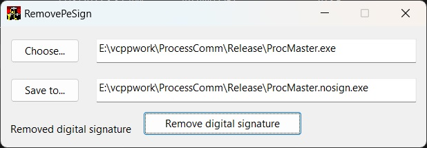

# PE Files Digital Signature Remover

This is a utility for removing the digital signatures from PE files, including exe, dll, sys, etc. Currently only support x86 Win32 platform.

Designed based on Windows Template Library (WTL). So you have to [preinstall](https://sourceforge.net/projects/wtl/files/WTL%2010/WTL%2010.0.10320%20Release/) its latest version before building this project in Visual Studio.

Screenshot:

